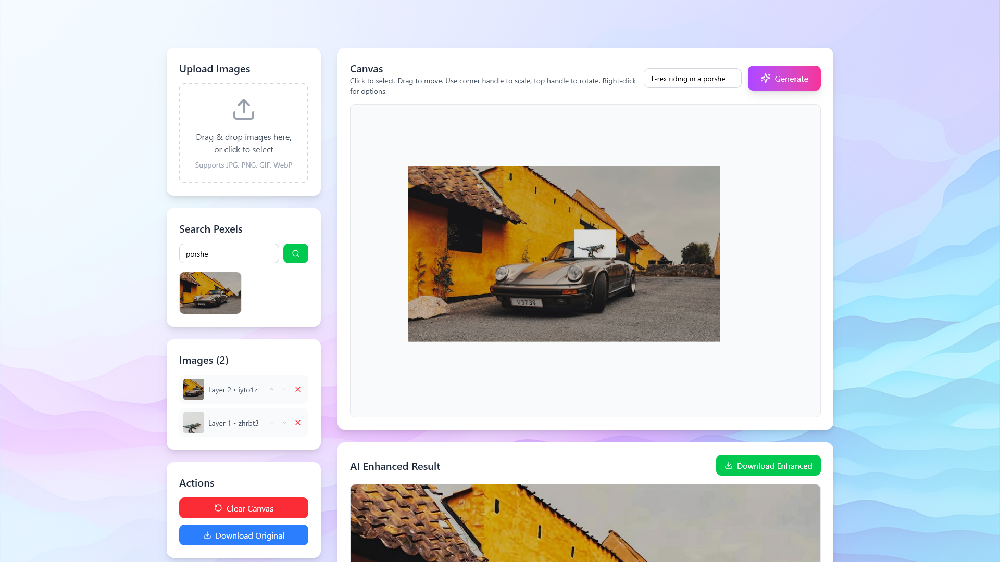
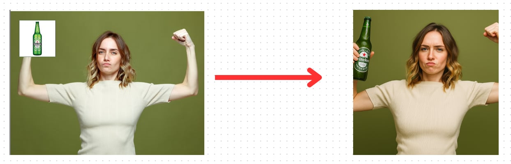

# AI-Powered Collage Creator

A sophisticated web application that combines traditional image editing capabilities with cutting-edge AI technology to create professional-quality digital assets and marketing materials.



_The intuitive interface allows you to upload images, transform them, and enhance with AI_

## 🎨 What It Does

The AI-Powered Collage Creator is a comprehensive tool that allows users to:

### 📸 **Upload & Source Images**

- **Drag & Drop Upload**: Seamlessly upload your own images (JPG, PNG, GIF, WebP)
- **Pexels Integration**: Search and add high-quality stock photos directly from Pexels
- **Multiple Formats**: Support for various image formats and sizes

### 🎯 **Advanced Image Manipulation**

- **Transform Controls**: Scale, rotate, and position images with precision
- **Layer Management**: Organize images in layers with forward/backward controls
- **Interactive Canvas**: Click to select, drag to move, use handles for scaling and rotation
- **Context Menus**: Right-click for additional options like "Bring to Front" or "Send to Back"

### 🤖 **AI-Powered Enhancement**

- **Smart Enhancement**: Transform basic collages into professional marketing materials
- **Custom Prompts**: Add your own enhancement instructions for personalized results
- **Auto-Suggestions**: AI analyzes your enhanced image and provides improvement suggestions
- **Iterative Editing**: Make multiple edits to perfect your result



_See the power of AI transformation: from basic collage to professional marketing material_

### 💾 **Export & Download**

- **Original Export**: Download your collage as-is
- **Enhanced Export**: Download the AI-enhanced professional version
- **High Quality**: Maintain image quality throughout the process

## 🚀 Key Features

### **Intuitive Interface**

- Clean, modern design with a beautiful gradient background
- Responsive layout that works on desktop and tablet
- Real-time preview of all changes

### **Professional Results**

- AI transforms amateur collages into studio-quality assets
- Enhanced colors, lighting, and composition
- Perfect for marketing materials, social media, and presentations

### **Smart AI Integration**

- Uses advanced AI models for image enhancement
- Automatic analysis and suggestion generation
- Maintains artistic intent while improving quality

### **Flexible Workflow**

- Start with any combination of images
- Apply transformations and adjustments
- Enhance with AI for professional results
- Iterate and refine as needed

## 🛠️ Technology Stack

- **Frontend**: React 18, TypeScript, Next.js 14 (App Router)
- **Styling**: Tailwind CSS with custom components
- **UI Components**: shadcn/ui components
- **File Handling**: react-dropzone for drag & drop
- **External APIs**: Pexels API for stock photos
- **AI Integration**: Custom AI enhancement pipeline
- **Canvas**: HTML5 Canvas for image manipulation

## 📱 How to Use

### 1. **Add Images**

- Drag and drop your own images into the upload area
- Or search Pexels for high-quality stock photos
- Images are automatically sized and positioned on the canvas

### 2. **Transform & Layer**

- Click to select any image
- Drag to move, use corner handles to scale, top handle to rotate
- Use the sidebar controls for precise adjustments
- Right-click for layer management options

### 3. **AI Enhance**

- Add a custom enhancement prompt (optional)
- Click "Generate" to transform your collage
- AI will enhance colors, lighting, and overall composition

### 4. **Edit & Refine**

- Review AI-generated suggestions for improvements
- Apply suggestions or make custom edits
- Iterate as many times as needed

### 5. **Download & Share**

- Download the original collage
- Download the enhanced professional version
- Perfect for marketing, social media, or presentations

## 🎯 Perfect For

- **Marketing Teams**: Create professional marketing materials quickly
- **Social Media Managers**: Generate engaging visual content
- **Designers**: Rapid prototyping and concept development
- **Content Creators**: Transform basic images into polished assets
- **Small Businesses**: Professional visuals without design expertise

## 🔧 Installation & Setup

```bash
# Clone the repository
git clone [repository-url]

# Install dependencies
pnpm install

# Set up environment variables
cp .env.example .env.local

# Run the development server
pnpm dev
```

## 🌟 Why Choose This Tool?

### **Time-Saving**

- Transform basic collages into professional assets in seconds
- No need for complex design software
- AI handles the technical aspects of enhancement

### **Professional Quality**

- Studio-quality results without design expertise
- Enhanced colors, lighting, and composition
- Perfect for marketing and professional use

### **User-Friendly**

- Intuitive drag-and-drop interface
- Real-time preview of all changes
- No steep learning curve

### **Flexible & Powerful**

- Start with any images you have
- Custom enhancement prompts for personalized results
- Iterative editing for perfect results

## 🎨 Use Cases

- **Marketing Materials**: Create professional banners, posters, and ads
- **Social Media Content**: Generate engaging posts and stories
- **Presentations**: Add visual appeal to business presentations
- **E-commerce**: Create product collages and promotional images
- **Personal Projects**: Design cards, invitations, and personal artwork

## 🔮 Future Enhancements

- Additional AI models for different artistic styles
- More stock photo sources
- Advanced text and typography tools
- Template library for common use cases
- Collaboration features for team projects

---

**Transform your ideas into professional visuals with the power of AI!** 🚀
